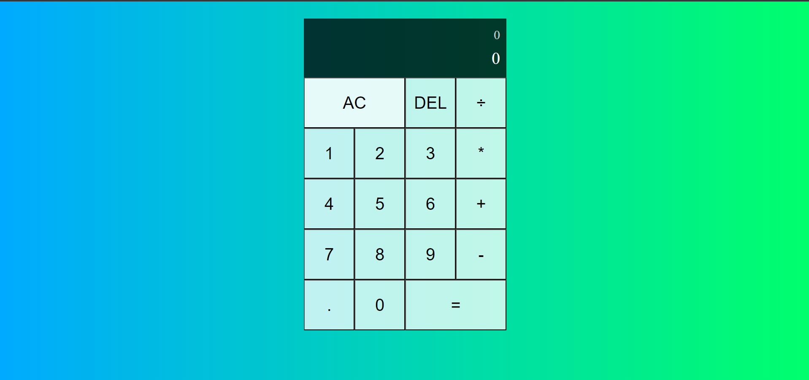

# Calculator App

A simple calculator application built with React and TypeScript.

## Table of contents

- [Overview](#overview)
- [The challenge](#the-challenge)
- [Features](#features)
- [Screenshot](#screenshot)
- [My process](#my-process)
  - [Built with](#built-with)
  - [What I learned](#what-i-learned)
- [Links](#links)
- [Author](#author)

## Overview

This calculator app provides basic arithmetic calculations such as addition, subtraction, multiplication, and division. It allows users to input numbers and perform operations, displaying the result in real-time.

### The challenge

Users should be able to:

- Enter numbers by clicking on the digit buttons.
- Select an operation by clicking on the respective operation button.
- The current operand and previous operand will be displayed in the output section.
- Click the "=" button to calculate the result.
- Use the clear button (AC) to reset the calculator.
- Use the delete button (DEL) to remove the last entered digit.

### Features

- Basic arithmetic operations: addition, subtraction, multiplication, and division.
- Real-time result display.
- Clear button to reset the calculator.
- Delete button to remove the last digit entered.

### Screenshot

## My process

### Built with

- Semantic HTML5 markup
- CSS custom properties
- Typescript
- React

### What I learned

During the development of this calculator app, I had the opportunity to learn and practice the following concepts:

- React functional components and class components
- State management in React using hooks and the useState hook
- Handling user interactions and events in React
- Conditional rendering in React
- Styling and layout using CSS
- Building a responsive user interface
- Using TypeScript with React for type safety
- Writing clean and maintainable code

### Links

- Solution URL: [Solution URL](https://github.com/AshwanthramKL/calculator)
- Live Site URL: [Live site URL](https://social-media-react-91b94.web.app/)

## Author

- Website - [MARTIALEAGLE](https://github.com/AshwanthramKL)
- Frontend Mentor - [@AshwanthramKL](https://www.frontendmentor.io/profile/AshwanthramKL)
- Twitter - [@AshwanthramKL](https://www.twitter.com/AshwanthramKL)
